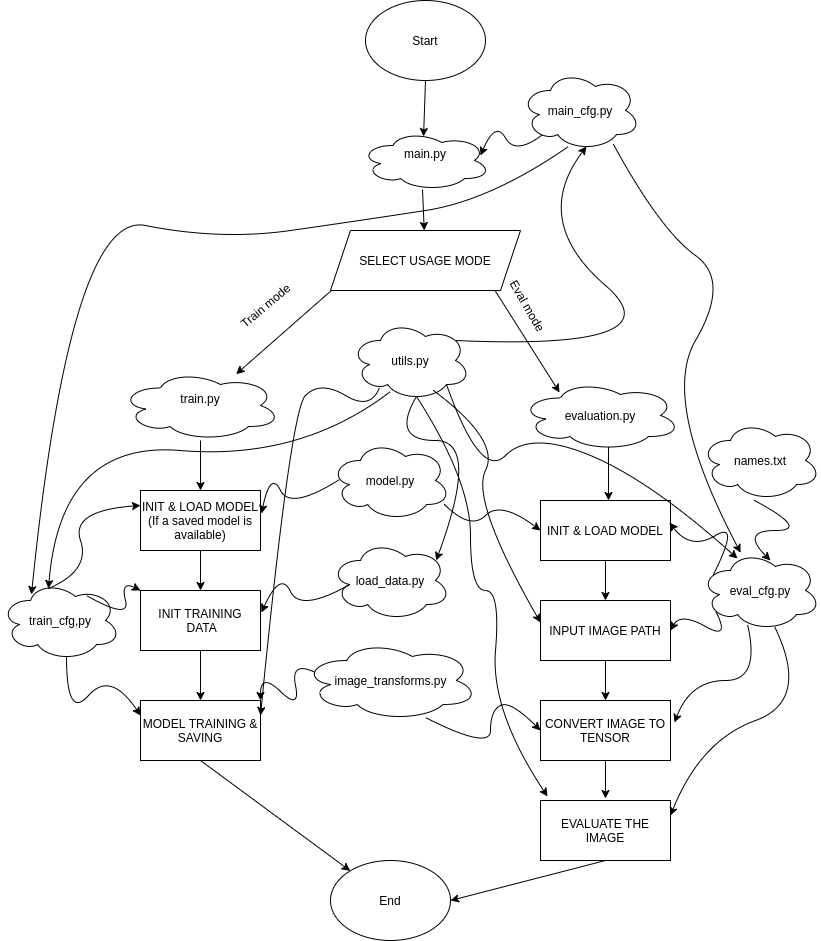

# VGG-16 PYTORCH 1.5

### Usage
`python main.py --mode eval` for evaluation mode or `python main.py --mode train` for training mode.

- Note that user can also supply more parameters to the program such as **learning_rate**, **dataset_path** and **model_name**.
- Type `python main.py --help` for all the parameters that can be supplied and more information about each parameter.

The above diagram shows the working of the program in this repo. The clouds represent the file names while the rectangles represent the processes that are taking place at a particular time. The parallellogram represents the decision making process. Straight line arrows from a cloud represent the process that are taking place in that particular cloud while the same straight line arrows from a rectangle represent the process that comes after the process in the said rectangle. A curvy line arrow from a cloud represents that the file in the cloud is used as a module in the destination.

### Program Flow
1) `main.py` file will be executed first in this program. User has to decide to use this program to train a VGG-16 model or to use a trained model for evaluation.
2) If the user chose to **train** a model, then `train.py` will be executed.
a) A VGG-16 neural network will be initialized with the default or given paremeters and if there is already a trained model present, the model will be loaded into the network.
b) The training data will be initialized based on the default or given paremeters to be used for training.
c) The model will be trained based on the given paremeters or default parameters.
3) If the user chose to **evaluate** an image, then `evaluation.py` will be executed.
a) A VGG-16 neural network will be initialized based on the given or default parameters and loads the trained model into the network.
b) User will have to input the path to the image that they wish to be evaluated.
c) The image will then be converted to tensor format.
d) The tensor image will be evaluated using the loaded model.

### Modules
There are a total of 11 files for this program. Other than `main.py`, `train.py` and `evaluation.py`, all the other files are used as a module to these 3 files. `main_cfg.py` contains the general parameters for the entire program. User can define their own parameters into this file by supplying the parameters when executing `main.py`. During the training, `train_cfg.py` will be heavily used to supply the parameters needed while `eval_cfg.py` will be used during the evaluation. Notice that `eval_cfg.py` is using `names.txt` while `train_cfg.py` does not. This is because `train_cfg` gets the information of the data classes from the training dataset itself while during evaluation this dataset is assumed to be unavailable. Hence the usage of `names.txt` to manually supply the class information. `model.py`, `load_data.py` and `image_transforms.py` are used by both evaluation process and training prcess. Therefore, these 3 files are not and should not be using `train_cfg.py` or `eval_cfg.py`. Note that `utils.py` contains helper functions that are universal across the program. Hence the reason that `utils.py` does not use any other file as module.

#### License
___
**MIT**

